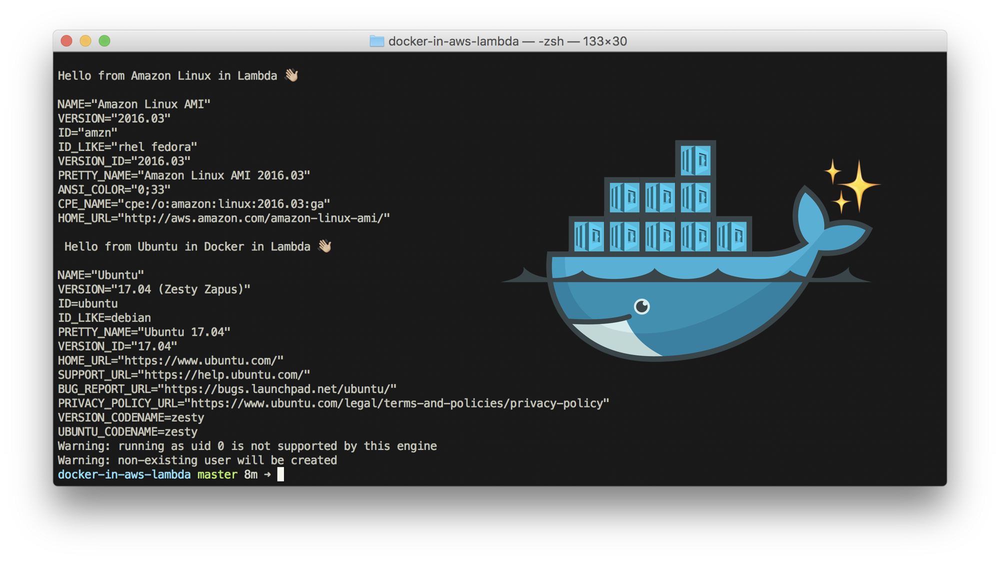

## l a m b d a s

<!---->

### lambdas
#### aws-anarchy 🖥️
Perform management operations on AWS, such as shuffle data around S3, and keeping
AWS Athena partitions up to date.

#### bash-it ⌨️
The AWS runtime doesn't support bash. However, bash is one of my favorite languages,
and is portable acrosss \*nix systems. Surely there is a way to break out of the
container AWS Lambda confines you to?

Nominally, uses a python runtime. But that's just an overhead wrapper before we
drop down into the good stuff.

#### docker-in-lambda 🐳
Proof of concept of running Docker in AWS Lambda.

Makes use of [udocker](https://github.com/indigo-dc/udocker) to run docker containers under the user account (as opposed to normally using root privileges). Also uses [libfakechroot](https://github.com/dex4er/fakechroot/wiki).

#### iris 📊
Using the docker-in-lambda work, get a container running and sending an email on how my portfolio is doing for the day. Dependency on markets-etl and treats AWS Athena as its database.

Lots of interesting work done here, not just on the infrastructure side, but also writing a bash wrapper to treat the aws cli like a psql client: <https://github.com/skilbjo/iris/blob/master/src/athena>

See <https://github.com/skilbjo/iris> for more

#### markets-etl 📈
Get the latest markets data , write results to S3.

One of the more interesting parts of this project is the `insert-to-athena!` function, in contrast to a similar `jdbc/insert!` type of function: <https://github.com/skilbjo/lambdas/blob/master/markets-etl/deploy/build-project#L119>

See <https://github.com/skilbjo/markets-etl>

#### ping-it 🔔
Keep my Github contributions active 😀
