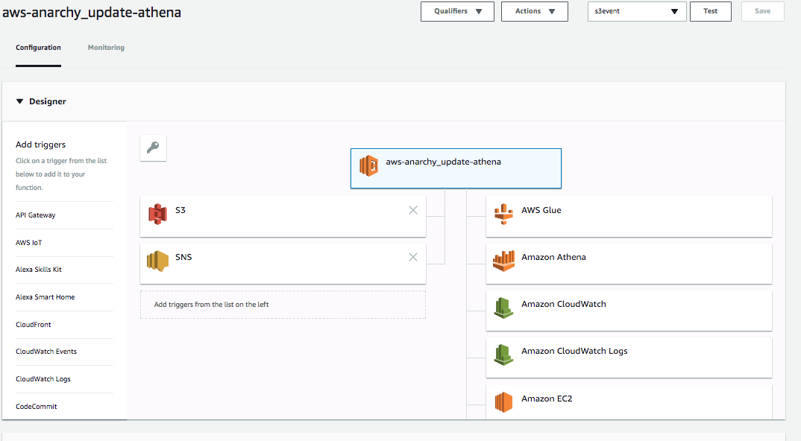
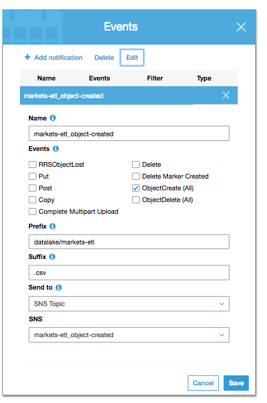

# aws-anarchy lambda

## what

Perform AWS management operations, such as shuffle data around S3, and run AWS
Athena queries for updating the AWS Athena metastore.

## jobs
- update-athena (run `msck repair table dw.[table]` on new file trigger)

## build

```bash
deploy/build-project
```

## config



### triggers
- sns/s3 on skilbjo-data bucket



### execution role
- `lambda_with_athena`

### runtime
- 360mb
- 3 minute timeout
