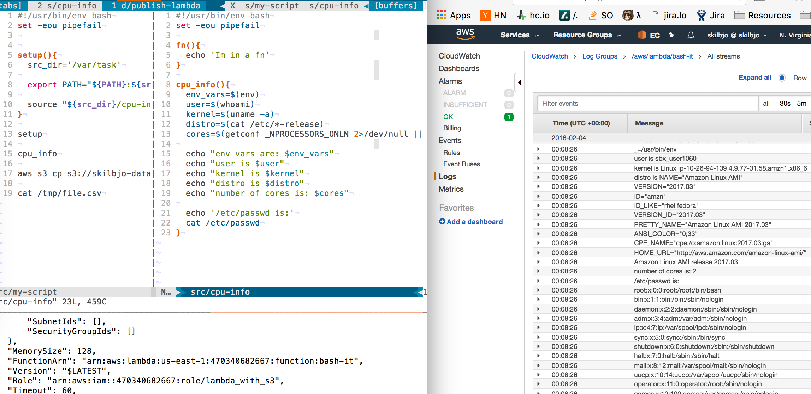
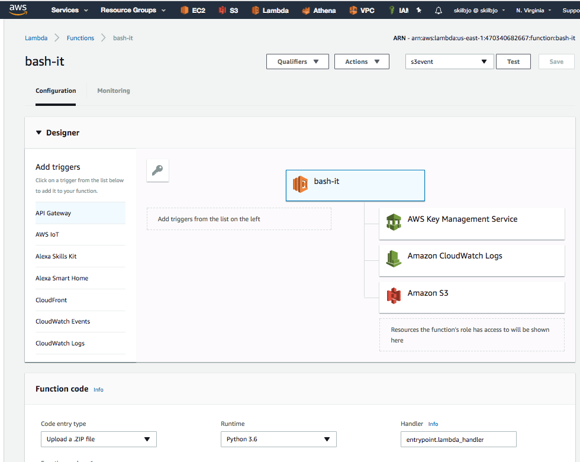

# bash-it lambda

## what

The AWS runtime doesn't support bash. However, bash is one of my favorite languages,
and is portable acrosss \*nix systems. Surely there is a way to break out of the
container AWS Lambda confines you to?

Nominally, uses a python runtime. But that's just an overhead wrapper before we
drop down into the good stuff.



## build

```bash
deploy/build-project
```

## config



### triggers
- manually

### execution role
- lambda_with_s3

### runtime
- 128mb
- 1 minute timeout

## scratch

```python
import os
import subprocess

path = '/tmp/bin'

cmdline = [os.path.join(path, 'my-script')]
subprocess.run(cmdline,
               shell=True,
               check=True,
               stderr=subprocess.STDOUT)
```
