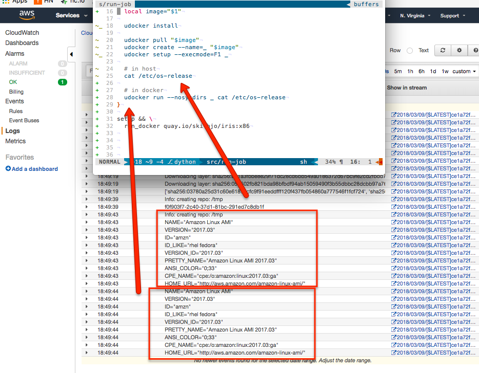

# docker-in-lambda

## what

Docker in Lambda. The ultimate in functions-as-a-service and serverless
computing.  Docker images are perfect because of dependency management and the
promise of virtualization. The AWS Lambda product is great because it's free
(and serverless- no management overhead) computing infrastructure.

There are a few limitations, however. The AWS Lambda product is pretty
locked-down, so some trade-offs need to be made. The largest is you can't run
docker on AWS Lambda. That seems like a deal-breaker; however, there is a tool
that allows you to run docker images, udocker: <https://github.com/indigo-dc/udocker>

However, the current master/development branches of udocker don't work with
AWS Lambda, so a compatible artifact exists here: <https://raw.githubusercontent.com/grycap/scar/master/lambda/udocker>

udocker also requires `patchelf` to be pre-installed in the docker image before
runtime. Add something like this in the Dockerfile at buildtime:

```bash
RUN apk add -U patchelf
```

Additionally, there are a few unresolved issues on how Alpine Linux and udocker
don't play well together. An alternative minimalist image is: bitname/minideb
<https://github.com/bitnami/minideb>



## build
```bash
deploy/build-project
```

## config
### env vars
```bash
export github_token_encrypted=''
```

### triggers
- none

### execution role
- lambda_exec

### runtime
- 128mb
- (* 3 60) second timeout

### Links
- <https://hackernoon.com/how-did-i-hack-aws-lambda-to-run-docker-containers-7184dc47c09b>
- <https://github.com/vladgolubev/docker-in-aws-lambda>
- <https://github.com/indigo-dc/udocker>
- <https://github.com/indigo-dc/udocker/blob/master/doc/user_manual.md>
- <https://github.com/grycap/scar>
- <https://github.com/indigo-dc/udocker/issues/121>
