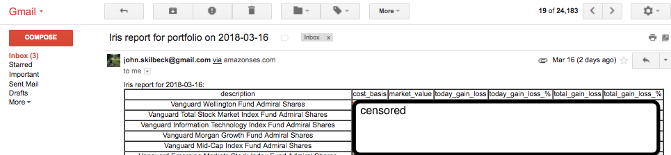

## iris 📊

### what 
Using the docker-in-lambda work (the ultimate in functions-as-a-service, serverless computing, and virtualization and containerization), get a container running and sending an email on how my portfolio is doing for the day. Dependency on markets-etl and treats AWS Athena as its database.

Lots of interesting work done here, not just on the infrastructure side, but also writing a bash wrapper to treat the aws cli like a psql client: <https://github.com/skilbjo/iris/blob/master/src/athena>

See <https://github.com/skilbjo/iris> for more



## build
```bash
mkvirtualenv pylambda || workon pylambda
(pylambda) deploy/build-project && test/run-tests
```

## config
### env vars
```bash
export aws_access_key_id=''
export aws_secret_access_key=''
export email=''
export email_pw_encrypted=''
```

### triggers
- Cloudwatch rule -> schedule -> cron expression: `35 22 ? * MON-FRI *`

### execution role
- lambda\_with\_s3

### runtime
- 128mb
- (* 5 60) second timeout
- No VPC
