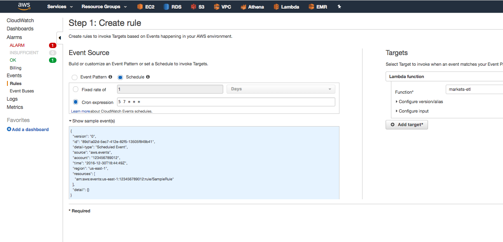

## m a r k e t s - e t l  l a m b d a

[](https://healthchecks.io/badge/80da65e9-ff8f-45f1-b75e-109790/yfJXsnyi/markets-etl_aws.svg)

### what
markets-etl, but in lambda form

### build
```bash
run deploy/build-project
```

### config
#### env vars
```bash
export healthchecks_io_api_key=''
export quandl_api_key=''
export tiingo_api_key=''
```

#### execution role
- lambda\_with\_s3

#### triggers
Cloudwatch rules are in UTC (~ -7/-8hrs to PST)

##### Morningstar API is ready
3:20pm, M-F
- Cloudwatch rules/schedule, cron expression -> `20 22 ? * MON-FRI *`

##### Tiingo API is ready
6:00pm, M-F
- Cloudwatch rule -> schedule -> cron expression: `0 1 ? * TUE-SAT *`

##### event
payload:

```json
{
  "version": "0",
  "id": "89d1a02d-5ec7-412e-82f5-13505f849b41",
  "detail-type": "Scheduled Event",
  "source": "aws.events",
  "account": "123456789012",
  "time": "2016-12-30T18:44:49Z",
  "region": "us-east-1",
  "resources": [
    "arn:aws:events:us-east-1:123456789012:rule/SampleRule"
  ],
  "detail": {}
}
```

##### setup




